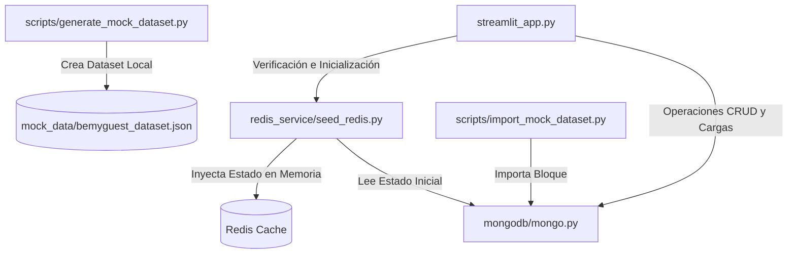

# 📁 Documentación Técnica — Versión 1.0 (v.1)

Bienvenido a la documentación técnica de la primera versión funcional del backend multi-motor de **BeMyGuest**. Esta sección cubre en detalle el rol, la estructura y la funcionalidad de cada módulo del proyecto actual.

---

## 🗺️ Mapa de Módulos Documentados

Haz clic en cualquiera de los enlaces para ver el detalle de cada componente:

### 1. [🖥️ Interfaz Streamlit (`streamlit_app.md`)](./streamlit_app.md)
Detalla la interfaz de usuario administrativa, las pestañas funcionales (explorador, creador, seed de datos) y cómo interactúa con el backend.

### 2. [🗄️ Módulo MongoDB (`modulo_mongodb.md`)](./modulo_mongodb.md)
Detalle del motor principal operacional: esquemas de documentos (flexibles), configuración del cliente y funciones de persistencia de datos.

### 3. [⚡ Módulo Redis Service (`modulo_redis.md`)](./modulo_redis.md)
Detalla el plan técnico para la gestión de disponibilidad en tiempo real, bloqueos atómicos temporales (anti-overbooking) y el script de población inicial (*seeding*).

### 4. [🛠️ Módulo de Scripts y Dataset (`modulo_scripts.md`)](./modulo_scripts.md)
Detalla el generador de mock data estático y determinista de más de 1,500 registros y la herramienta CLI para importación rápida.

---

## 🏛️ Resumen Arquitectónico de la v.1

En esta etapa inicial del TPI, el flujo operativo del sistema está estructurado bajo la siguiente arquitectura simplificada de datos:

* **MongoDB** actúa como la única fuente de verdad (*Source of Truth*) guardando de forma permanente los documentos operacionales.
* **Redis** se acopla como un motor de soporte rápido e inicial para poblar y verificar disponibilidad de habitaciones.
* **Streamlit** consolida la experiencia visual del administrador del sistema.
