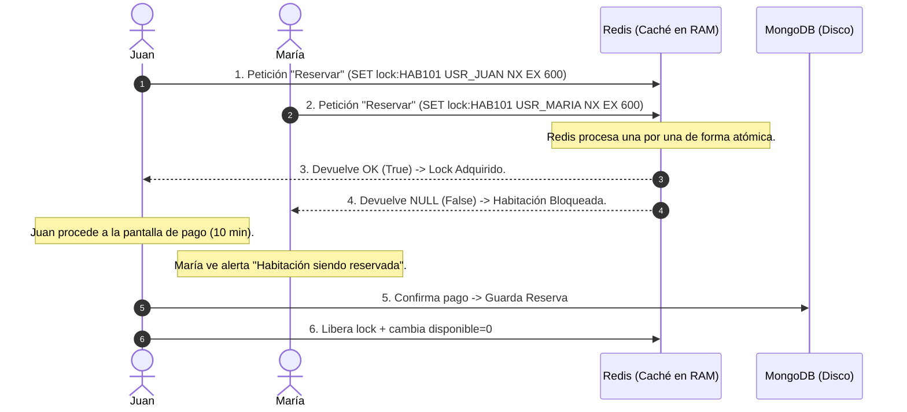

# 🔒 Explicación Técnica: Concurrencia y Bloqueos Atómicos (`adquirir_lock`)

Este documento detalla el funcionamiento del mecanismo de **Pessimistic Locking** (Bloqueo Pesimista) implementado en el servicio de Redis de **BeMyGuest**. Este es el componente estrella del Trabajo Práctico Integrador (TPI) para demostrar el control de concurrencia y el manejo de datos en tiempo real con latencia ultra-baja.

---

## 💡 1. El Problema de Negocio: Overbooking (Sobreventa)

En cualquier plataforma de reservas hoteleras (como Airbnb o Booking), la sobreventa es un fallo crítico. 

### El Escenario de Colisión:
1. **Juan** y **María** están buscando hospedaje y entran a la misma habitación (ej: Habitación `101`) en el mismo instante.
2. Ambos ven que está "disponible" y hacen clic en el botón **"Reservar"** exactamente en la misma milésima de segundo.
3. **Sin control de concurrencia**: Ambas peticiones llegarían a la base de datos principal (MongoDB). Se crearían dos documentos de reserva para la misma habitación en la misma fecha. La habitación se habría sobrevendido.

---

## ⚡ 2. La Solución NoSQL: Bloqueo en Memoria con Redis

Para evitar consultar constantemente el disco duro (MongoDB) y resolver la colisión a la velocidad de la luz, colocamos un **candado temporal en la memoria RAM** usando Redis *antes* de persistir cualquier dato en MongoDB.



---

## 🔍 3. Análisis Técnico del Código

La función encargada de este proceso en `redis_service/redis_service.py` está estructurada así:

```python
def adquirir_lock(habitacion_id, usuario_id):
    key = f"lock:habitacion:{habitacion_id}"
    # set() con nx=True retorna True si crea la llave, None si ya existe
    return r.set(key, usuario_id, nx=True, ex=600)
```

### Explicación detallada de cada línea:

#### A. La Clave Única (`key`)
`f"lock:habitacion:{habitacion_id}"`  
Crea una clave con nomenclatura jerárquica estructurada usando dos puntos (`:`). Ejemplo: `lock:habitacion:HAB0005`.

#### B. El Valor (`usuario_id`)
Se almacena el ID del usuario que inicia la reserva (ej: `"USR001"`). Esto es fundamental porque **identifica al dueño del candado**. Solo el usuario que tiene asignado el candado podrá confirmar la reserva definitiva en MongoDB.

#### C. El Parámetro Atómico `nx=True` (SETNX)
* **`NX` significa "Set if Not Exists"** (Establecer si no existe).
* Redis es **mono-hilo** (*single-threaded*), lo que significa que ejecuta todas las operaciones estrictamente en cola, una por una.
* Si la petición de Juan llega una millonésima de segundo antes que la de María:
  * Redis procesa la petición de Juan, ve que la clave `lock:habitacion:HAB0005` **no existe**, la crea y devuelve `True`.
  * Inmediatamente después, procesa la de María, ve que la clave **ya existe**, no hace nada y devuelve `None` (Null).
* Esto garantiza que la comprobación y la creación del bloqueo ocurran como una **única acción indivisible (atómica)**, eliminando las condiciones de carrera (*race conditions*).

#### D. La Expiración Temporal `ex=600` (TTL)
* Configura un **Time-to-Live (TTL)** de 600 segundos (10 minutos).
* **¿Por qué es indispensable?**: Si un usuario bloquea una habitación pero a mitad del pago se le corta la luz, se le apaga el celular o simplemente decide cerrar el navegador y abandonar la compra, la habitación no puede quedar bloqueada para siempre.
* Al expirar los 10 minutos, Redis elimina la clave automáticamente de la memoria RAM y la habitación vuelve a estar disponible para el resto del público.

---

## 🎯 4. Conceptos Clave para la Defensa Oral (TPI)

> [!TIP]
> Si la docente te pregunta sobre la implementación de Redis en el examen oral, estas tres definiciones te garantizarán la nota máxima:

1. **Atomicidad**: *"Usamos la opción `NX` de Redis para que la verificación de la existencia de la clave y su creación ocurran en un solo paso atómico. Esto impide que dos peticiones simultáneas pasen el filtro al mismo tiempo."*
2. **Time-to-Live (TTL)**: *"Establecemos una expiración de 10 minutos en la clave del bloqueo. Esto simula un carrito de compras real, liberando de forma automática los recursos en memoria RAM si la transacción es abandonada por el cliente."*
3. **Resiliencia (Fallback)**: *"El sistema está diseñado de forma defensiva. Si el servidor de Redis llega a estar caído, el backend atrapa la excepción y degrada el servicio automáticamente para consultar de forma directa el estado en MongoDB, evitando que la aplicación web se interrumpa."*

---

## 💻 5. Cómo Demostrarlo en Vivo (Simulación en `redis-cli`)

Para sorprender a los evaluadores, puedes interactuar en la web de Streamlit y mostrar el estado de las llaves en caliente desde la consola:

1. **Paso 1**: Ve a la UI y haz clic en **"Iniciar Reserva (Bloquear en Redis)"**.
2. **Paso 2**: Abre una terminal en tu computadora y ejecuta la consola interactiva:
   ```bash
   redis-cli
   ```
3. **Paso 3**: Consulta quién tiene el candado en tiempo real:
   ```bash
   > GET lock:habitacion:HAB0001
   "USR0001"  # Devuelve el ID del usuario dueño del lock
   ```
4. **Paso 4**: Consulta cuánto tiempo le queda al bloqueo antes de expirar:
   ```bash
   > TTL lock:habitacion:HAB0001
   542        # Segundos restantes antes de auto-eliminarse
   ```
5. **Paso 5**: Completa la confirmación en la UI y verifica que el bloqueo se eliminó y la disponibilidad cambió:
   ```bash
   > EXISTS lock:habitacion:HAB0001
   (integer) 0  # El candado ya no existe en memoria (fue liberado)
   
   > GET habitacion:HAB0001:disponible
   "0"          # Ahora la disponibilidad es cero (no disponible)
   ```
