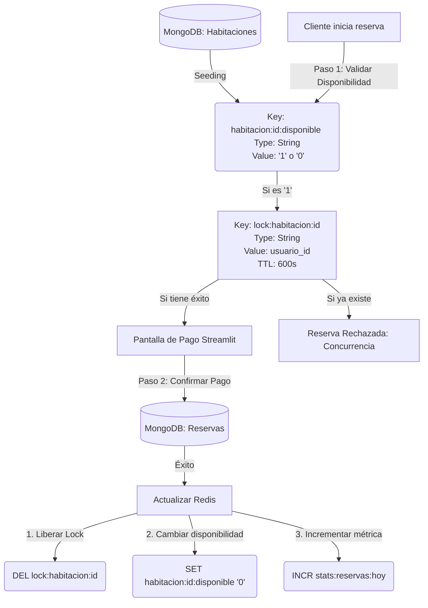

# ⚡ Modelo de Datos y Estructura en Redis

Este documento detalla el **Modelado de Datos (Key-Value Schema)** implementado en Redis para la plataforma **BeMyGuest**. A diferencia de MongoDB (documental) o bases de datos relacionales tradicionales, Redis no posee un esquema rígido de tablas, sino que organiza la información en memoria usando estructuras de clave-valor optimizadas por tipo de dato y con control de expiración temporal (TTL).

---

## 🏛️ Jerarquía de Nombres (Naming Convention)

Para evitar colisiones de llaves y organizar el espacio de nombres (*namespace*), implementamos la convención estándar de la industria usando dos puntos (`:`) como delimitador jerárquico:

$$\text{contexto} : \text{entidad} : \{\text{id}\} : \text{atributo}$$

* **Modularidad**: Facilita el filtrado y escaneo selectivo de llaves mediante patrones (`KEYS` o `SCAN`).
* **Lectura**: Es auto-documentado; con solo leer la clave se conoce su propósito y tipo de dato asociado.

---

## 📊 Estructura de Datos

A continuación, se detalla el modelo de datos activo en Redis:

| Clave (Key) | Tipo de Dato | Estructura del Valor / Campos | TTL | Propósito en el Negocio |
| :--- | :--- | :--- | :--- | :--- |
| `habitacion:{id}:disponible` | **String** | `"1"` (Disponible) / `"0"` (No disponible) | No (Permanente) | Caché de disponibilidad en tiempo real para optimizar la consulta rápida de catálogo. |
| `lock:habitacion:{id}` | **String** | `{usuario_id}` (ID del dueño del lock) | 600 segundos (10 min) | Bloqueo temporal atómico (*Pessimistic Locking*) durante el flujo de pago para prevenir overbooking. |
| `sesion:{token}` | **Hash** | `user_id`: String   `rol`: String   `last_activity`: Epoch Timestamp | 3600 segundos (1 hora) | Gestión de sesión del usuario en memoria con timeout automático por inactividad. |
| `stats:reservas:hoy` | **Counter** | Entero autoincrementable (Ej: `15`) | 86400 segundos (24 hs) | Métricas operativas diarias en memoria de alta velocidad, auto-expirable a la medianoche. |

---

## 🕸️ Diagrama de Flujo y Relaciones

El siguiente diagrama ilustra cómo interactúan las diferentes llaves durante el ciclo de vida de una reserva en la base de datos:

---